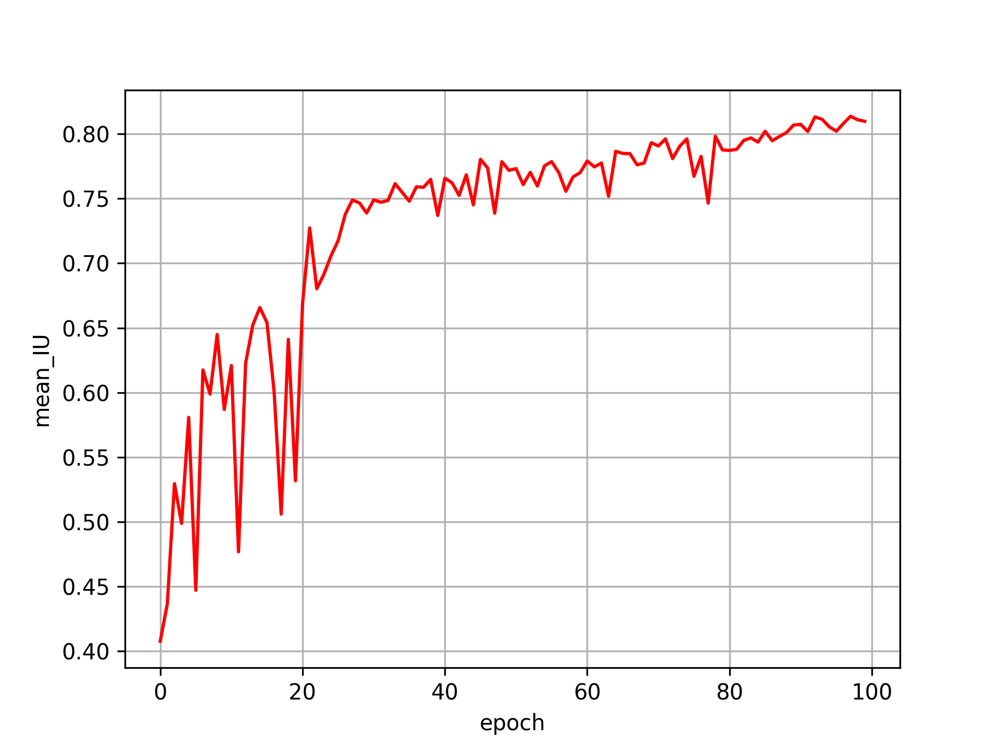

# Smoke Segmentation Project

The objective of this repository is to provide the means to create a large image dataset for the task of smoke segmentation. It also provides the corresponding tools (including a segmentation UI) for image data curation and a guide to automatically convert a large amount of image detection-based labels to image segmentation labels. Additionally it encompasses the methods and tools to fine-tune a pre-trained smoke segmentation model based on external pre-trained segmenters.

## Fine-Tuned Models

Two models have been trained to get a comparison of how effective each is on the task of smoke segmentation.

## Results

| Model         | Pre-trained | Fine-Tuned   | mean IU | mean IU Smoke Class | Δt (~h) |
|---------------|-------------|--------------|---------|---------------|---------|
| BiSeNet - R18 | Cityscapes  | `S-Smoke-var0` | 80.81%  | 69.48%        | 3.5     |
| PIDNet Small  | Camvid      | `S-Smoke-var0` | 81.12%  | 69.84%        | 2       |

### Dataset Details

All S-Smoke-var0 ground truth masks were selected by a pool of segmentation masks generated by [[SAM](https://segment-anything.com/)]. SAM was prompted by the [[D-Fire](https://github.com/gaiasd/DFireDataset)] dataset's bounding boxes.

The resulting predictions along with a metrics diagram follows, showcasing the model's performance and its training potential.


The left image shows the input, the middle image is the combination of the input with the predicted segmentation mask, and the right image is the (pseudo) ground truth mask acquired by SAM.



The depicted plot of mean IU is computed on the validation set.

## D-Fire - External Dataset

[[D-Fire](https://github.com/gaiasd/DFireDataset)] is an image dataset of fire and smoke occurrences designed for machine learning and object detection algorithms with more than 21,000 images. The bounding box labels are stored inside `.txt` files in YOLO format (class + cxcywh).

## S-Smoke

We name S-Smoke to be any dataset consisted of D-Fire's images, with segmentation ground truth masks produced for the task of image smoke segmentation, where the ground truth masks are generated from a pre-trained SAM model, prompted by the bounding box labels of the D-Fire dataset. An oracle then filters out bad predictions.

My produced dataset is named as `S-Smoke-var0`, and is consisted by
- Number of train instances 2400
- Number of test instances 287

## Data Directory Structure

This is the data's directory structure, located in `./datasets`.
```
datasets
├── data_info
├── D-Fire
|   ├── test
|   |   ├── images
|   |   └── det_labels
|   └── train
|       ├── images
|       └── det_labels
└── S-Smoke
    ├── curated
    |   ├── test
    |   |   ├── images
    |   |   ├── seg_labels
    |   |   └── combined
    |   └── train
    └── raw
        ├── test
        |   ├── images
        |   ├── seg_labels
        |   └── combined
        └── train
```

## Model Directory Structure

This directory structure has to be built manually.
```
models
├── PIDNet
|   ├── finetuned
|   └── pretrained
|       └── PIDNet_S_Camvid_Test.pt
└── TorchSeg
    ├── finetuned
    └── pretrained
        └── cityscapes-bisenet-R18.pth
```

Download and place these at their corresponding directories

- [`PIDNet_S_Camvid_Test.pt`](https://drive.google.com/file/d/1h3IaUpssCnTWHiPEUkv-VgFmj86FkY3J/view?usp=sharing)
- [`cityscapes-bisenet-R18.pth`](https://drive.google.com/file/d/1hFF-J9qoXlbVRRUr29aWeQpL4Lwn45mU/view)

## Preparation

### Directory

<u>The developer has to manually create the preceeding directory structures prior to using any of the provided tools.</u> The D-Fire directory has to be filled with the corresponding files from the dataset. D-Fire's labels and images are expected to be in text and JPG file formats, and be named with the corresponding `.txt` and `.jpg` file extensions. Download and decompress the D-Fire dataset.

This is what the decompressed D-Fire directory will look like initially:
```
D-Fire
├── test
|   ├── det_labels
|   └── images
└── train
    ├── det_labels
    └── images
```
To align the paths with the currently provided scripts, you should rename the directories with names `labels` to `det_labels`.

Now download a pretrained SAM model through [[link](https://dl.fbaipublicfiles.com/segment_anything/sam_vit_l_0b3195.pth)] and place it inside `./models` directory.

### Dependencies

Apply
```
sudo apt-get install ninja-build
```
```
python3 -m pip install -r requirements.txt
```
Finally install [[Apex](https://github.com/nvidia/apex#installation)].

## Next Steps

First visit [[data_tools](https://github.com/fl0wxr/SmokeSegmenter/tree/master/data_tools)] to perform the semi-annotation by carefully following all instructions given by the corresponding `README.md`. After that you may train your own segmentation models through [[primary_segmenter](https://github.com/fl0wxr/SmokeSegmenter/tree/master/primary_segmenter)].

## Citation

- ycszen. [[TorchSeg](https://github.com/ycszen/TorchSeg)]
- XuJiacong. [[PIDNet](https://github.com/XuJiacong/PIDNet)]
- <p align="justify">Pedro Vinícius Almeida Borges de Venâncio, Adriano Chaves Lisboa, Adriano Vilela Barbosa: <a href="https://link.springer.com/article/10.1007/s00521-022-07467-z"> An automatic fire detection system based on deep convolutional neural networks for low-power, resource-constrained devices. </a> In: Neural Computing and Applications, 2022.</p>
- Kirillov, A., Mintun, E., Ravi, N., Mao, H., Rolland, C., Gustafson, L., Xiao, T., Whitehead, S., Berg, A., Lo, W.Y., Dollar, P., & Girshick, R. (2023). Segment Anything. arXiv:2304.02643.
