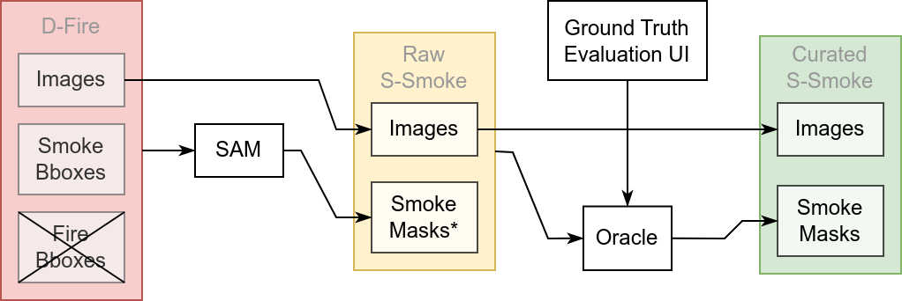

# Data Utilities

This directory contains essential tools necessary for constructing and refining the smoke segmentation dataset. The data pipeline involves a semi-annotation process leveraging the SAM (Segment Anything Model) segmenter and utilizes the external dataset named D-Fire. Alongside these utilities, there are visualization tools and a user interface (UI) designed to facilitate human intervention and pseudo-ground-truth evaluation.


## SAM

SAM operates on principles similar to those of LLMs like GPT. In a chatbot, the user's input sentence limits the model's focus within the context generated by the history of the current conversation. Similarly, in SAM, the user's prompt (in the form of a bounding box and object label) guides the model's focus within the image. This allows SAM to perform relevant segmentation tasks.

The analogies here are
- SAM is to an image as GPT is to a conversation context.
- A new user sentence in a chatbot is akin to a bounding box and object label in SAM.

## Directory Structure

```
data_tools
├── fig0.jpg
├── fig1.png
├── fig2.png
├── README.md
└── src
    ├── blacklist
    │   ├── blacklisted_instances.list
    │   └── session.path
    ├── config
    │   └── paths.json
    ├── gen_ssmoke_path_lists.py
    ├── preprocess_color.py
    ├── semi_auto_annotation
    │   ├── auto_annot.py
    │   ├── build_curated_dataset.py
    │   ├── combine_segm_instances.py
    │   └── oracle_evaluation.py
    └── utils
        ├── bbox2segm_mask.py
        ├── data.py
        └── visuals.py
```

### Setting Up All Paths

The paths of the data's directory along with the SAM model's file path should be specified inside `./src/config/paths.json`. An example follows
```
{
    "dfire_data_dp": "../../../datasets/D-Fire",
    "sam_fp": "../../../models/sam/sam_vit_l_0b3195.pth",
    "raw_ssmoke_data_dp": "../../../datasets/S-Smoke/raw",
    "curated_ssmoke_data_dp": "../../../datasets/S-Smoke/curated"
}
```

## Semi Automatic Annotation

The proper creation of pseudo-labels for the task of smoke segmentation, depends on the SAM and a human assisted by a UI to filter out all bad labels.



### Automatic Smoke Mask Generation

Navigate inside `./src/semi_auto_annotation` and apply
```
python3 auto_annot.py
```
This process will take a long time to complete.

### Oracle Evaluation

The evaluation of SAM's segmentation masks may yield several instances of disappointing smoke masks. To facilitate this evaluation process, a file, `./src/semi_auto_annotation/oracle_evaluation.py`, has been provided to the oracle (i.e. a human user in our case). This tool assists in visually inspecting each individual predicted mask.

Upon executing
```
python3 oracle_evaluation.py
```
the user is presented with a UI that aids in assessing the accuracy of predictions iteratively. The UI consists of three images:


- The top-left image displays the input image.
- The bottom-left image showcases the predicted mask, portraying white pixels for the foreground (smoke).
- The image on the right combines the input image and the predicted mask for easier comparison.

Located at the lower-left corner are two buttons:

- `Next [N]`: Allows skipping an image if the prediction appears satisfactory. Keyboard shortcut -> **N**
- `Add to Blacklist [B]`: Provides an option to flag unsatisfactory predictions for further analysis or action. Each time the user triggers this, the paths of the unsatisfactory image and its corresponding mask are added in `./blacklist/blacklisted_instances.list` separated by `", "`. Keyboard shortcut -> **B**

The user can also quit/interrupt the process by pressing **Q** (the session is saved).

This interface empowers the user to make intuitive judgments regarding the *accuracy* of the predicted masks, offering a straightforward means to manage and evaluate the predictions generated by the system.

### Blacklist

The next step is to copy all the non-blacklisted files, up until the checkpoint (see path inside `./data_tools/src/blacklist/session.path`) considering a alphanumerically reversed order of each instance's file path.

To apply this copy automatically, simply execute
```
python3 build_curated_dataset.py
```


